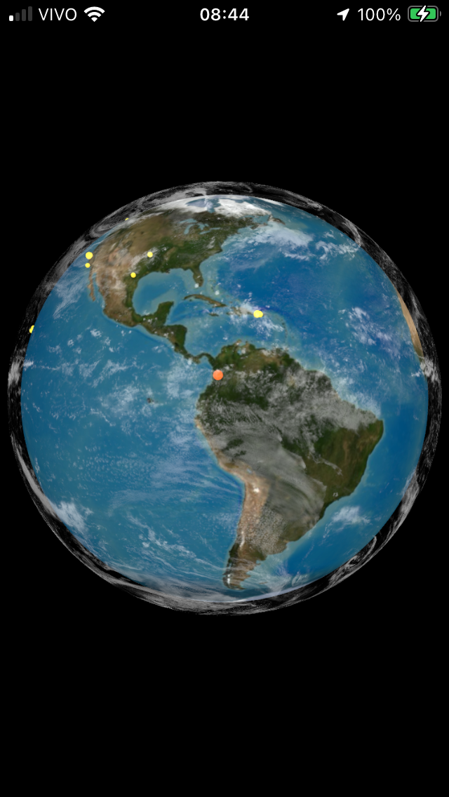
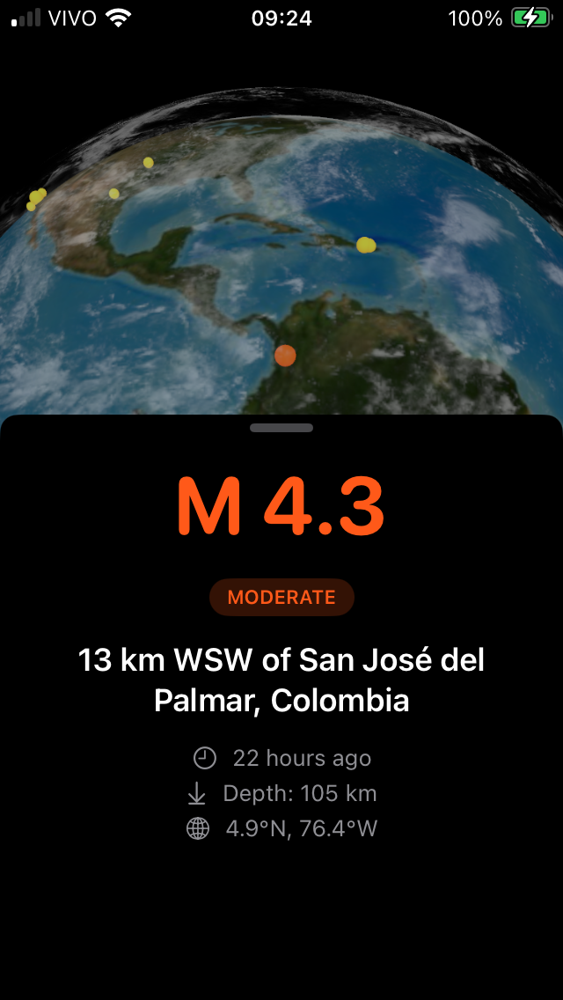

# QuakeGlobe 🌍

## Demo

A 25-second tour: globe birth, rotation with inertia, fly-to, favorites and the haptic ladder.

[Watch the demo (mp4, ~10 MB)](https://github.com/lucascompiles/QuakeGlobe/releases/download/v1.0/quakeglobe-demo.mp4)

📳 **Haptics**: the app vibrates in proportion to magnitude, from a light tick at M2.5 to a thunderclap with aftershocks at M8.

Real-time seismic activity on an interactive 3D globe.

## Features

- **Interactive 3D Globe**: SceneKit with real Earth texture, drifting cloud layer and **procedural 4K starfield** (code-generated sky with parallax, zero image assets for the background).
- **Haptic Feedback**: CoreHaptics engine scaling from M2.5 to M10 (tick, thunder, aftershock cascade, crescendo).
- **Fly-To Camera**: Cinematic easing from favorites (shortest-arc) and direct approach on marker tap.
- **Live Data**: USGS real-time feed (M2.5+, past 24h) with auto-refresh every 5 minutes.
- **Visual Encoding**: Markers scaled and colored by magnitude (yellow/orange/red).
- **Detail Sheet**: Tap any marker for magnitude, place, relative time, depth and coordinates.
- **Favorites**: Persisted with SwiftData, medium/large detents, swipe-to-delete.
- **Custom Camera Rig**: Inertia, zoom-proportional pan speed, smooth pinch zoom.
- **Accessibility**: VoiceOver audio list ordered by magnitude with stable navigation frames.
- **Performance**: Async texture decode and GPU prepare off the main thread.

## Stack

- **Swift / SwiftUI** + UIKit (`UIViewRepresentable`)
- **SceneKit** for the 3D globe, hit-testing and particle-free starfield
- **CoreHaptics** for the magnitude-proportional feedback
- **SwiftData** for favorites persistence
- **async/await** + `Codable` for the USGS GeoJSON feed
- **Swift Testing** for the model layer

## Setup

1. Clone the repo
2. Open `QuakeGlobe.xcodeproj` in Xcode 16+
3. Run on device or simulator (iOS 18+)

## Architecture

    QuakeGlobe/
    ├── Models/             # Earthquake, GeoJSON mapping, severity
    ├── Services/           # EarthquakeService (USGS fetch), HapticEngine
    ├── Views/              # FavoritesListView
    ├── ContentView.swift   # GlobeView (SceneKit) + detail sheet + camera logic
    └── QuakeGlobeTests/    # Swift Testing: decoding + severity

## Roadmap

- [ ] Search by location / place name
- [ ] Push notifications for significant earthquakes (M5.0+)
- [ ] Offline mode: cache de terremotos recentes
- [ ] 4K Earth texture swap for sharper close-ups